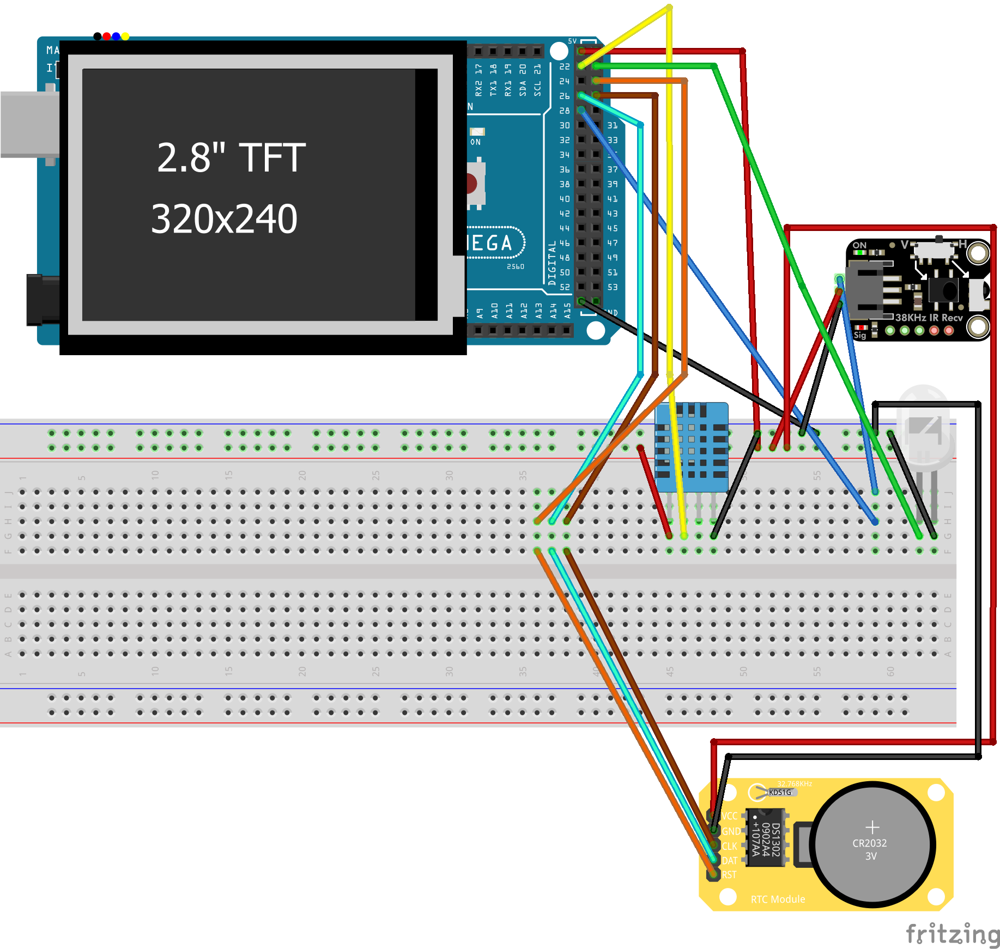

# Smart IR control

This repo contains code for Arduino Mega 2560 to control the devices such as AC using infrared light

## Getting Started
This project implements a Smart IR Control System using an Arduino Mega 2560, a 2.8-inch TFT touch screen, and various sensors and modules.
Its main purpose is to automatically control an Air Conditioner (AC) using IR signals, environmental conditions, and user input from the touchscreen interface.

The system reads temperature, humidity, time, and touch inputs, and uses these values to determine when the AC or fan should turn ON, OFF, or operate in automatic mode. These instructions should help you reproduce the results. 

### Prerequisites

Parts used: 
- Arduino Mega
- [Arduino 2.8 inch Touch Shield](https://www.amazon.com/Treedix-Display-Compatible-Arduino-Mega2560/dp/B08BHZTY7L/ref=sr_1_10?sr=8-10)
- [DS1302 RTC](https://www.amazon.com/DS1302-Clock-Module-Real-Time-Arduino/dp/B07Y64VW8X)
- [DHT11 Temperature and Humidity sensor](https://www.amazon.com/HiLetgo-Temperature-Humidity-Digital-3-3V-5V/dp/B01DKC2GQ0/ref=sr_1_1_sspa?sr=8-1-spons&sp_csd=d2lkZ2V0TmFtZT1zcF9hdGY&psc=1)
- [IR Receiver and Transmitter](https://www.amazon.com/Digital-Receiver-Transmitter-Electronic-Building/dp/B0DSVZ7NNC/ref=sr_1_15?sr=8-15)

### Schematics
#### DS1302:
- VCC -> 5V
- GND -> GND
- CLK -> 27
- DAT -> 26
- RST -> 25

#### DHT11:
- VCC -> 5V
- DAT -> 22
- GND -> GND

#### IR Receiver:
- VCC -> 5V
- GND -> GND
- DAT -> 28

#### IR Transmitter:
- DAT -> 23
- GND -> GND

